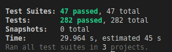

# Todo-List with DDD and Clean Architecture

## About

This project is a Todo-List application that follows Domain-Driven Design (DDD) and Clean Architecture. The application allows users to create, read, update and delete tasks. The goal of the project is to implement a solution that follows best practices in software development and is scalable, maintainable and easy to understand.

## Decisions

In this project, we used several patterns and techniques to implement the solution. Some of these include:

* Module Shared: this is a way to group common code and make it reusable in different parts of the application.
* Repository: a pattern that abstracts the data access layer and provides a way to interact with the database.
* Use-Case: this pattern defines the business logic of the application and helps to keep the code organized and easy to understand.
* Mapper: this pattern helps to transform data from one representation to another, for example, from a database model to a domain model.
* DTOs (Data Transfer Objects): objects that are used to transfer data between different layers of the application, for example, between the application layer and the domain layer.
* Builder: a pattern that helps to create complex objects step by step, making it easier to understand the code and reducing the number of constructors.
* Fixture: data that is used to set up the environment for testing.
* Presenter: a pattern that helps to transform data from the domain layer to a representation that can be easily consumed by the user interface.
* Providers: components that provide a specific service to the application, for example, a database provider or a network provider.
* Wrapper Data: a pattern that helps to wrap data with additional information, for example, metadata that is used to control the behavior of the application.

## Technologies Used

* Node.js
* JavaScript
* Nest.js
* TypeScript
* Jest
* MySQL2
* Sequelize

## Tests

In this project, the coverage target was 80% for all tests. To achieve this, use a combination of different testing techniques such as unit testing, integration testing, and e2e testing.

Jest was used as a testing framework and we follow the Test Pyramid, which means that I intend to have more unit tests than integration tests and less e2e tests.

the Builder pattern was used to create test data.



## Usage

* Run the project on Docker with two MySQL containers `(test e dev)`

```shell
docker-compose --profile dev up --build
```

* To run just the tests, use the command

```shell
docker-compose up --build
```

* Enter application container

```shell
docker-compose exec app bash
```

* Run the tests with coverage

```shell
npm run test:cov -- --runInBand --detectOpenHandles
```

* Upload the nestjs application

```shell
npm run start:dev
```

* available endpoints

```shell
# Todos #

http://localhost:3000/todos
```

* Examples of using the API can be found in the `api.http` file in the root of the project

## Documentation

Documentation for this project is currently in progress and will be added soon.
